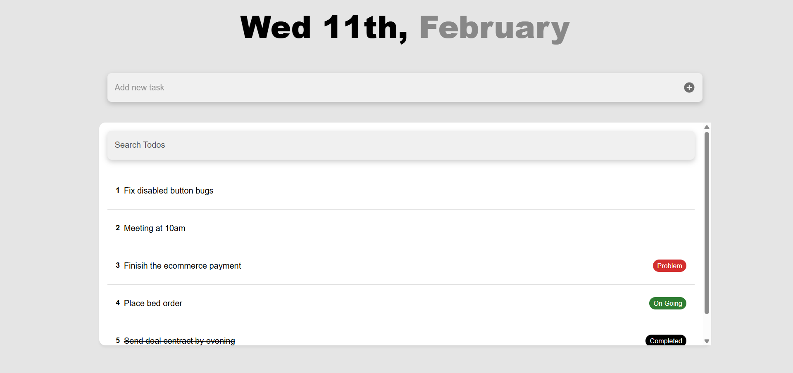
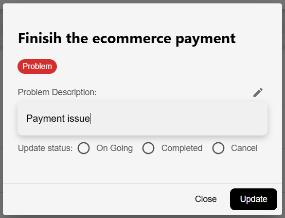
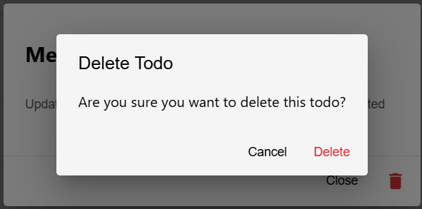

# Todo App - React JS

A minimalistic Todo application built to fulfill a Full Stack technical test. **Node.js version used:** v22.19.0.







## Tech Stack

- **React js**
- **MUI**
- **React Query**
- **Axios**
- **Formik** (configurable)
- **Yup**

## Features

- Add & delete todo
- Update todo's status & problem description
- Search Todos by title
- DTO-based validation
- CORS enabled for frontend access

## UI UX

- Clean, minimal black & white
- Custom MUI theme for TextField, Button, Card
- Responsive dialogs for adding and viewing todos
- Error and loading states

## State management

- Hooks using React Query for async CRUD operations
- Cache invalidations

## Project Setup & Run

1. Clone the repository

```bash
git clone https://github.com/ratukf/todo-frontend
```

2. Install dependencies:

```bash
$ npm install
```

3. Run the project:

```bash
$ npm run start
```

4. Run the backend by using this repository. Backend will be running at `http://localhost:5000/api/todos` (port is configurable in `todoService.js`)

https://github.com/ratukf/todo-backend

5. The app will be running at `http://localhost:3000`

## Technical Decision

1. React query for async CRUD operations and cache management
2. MUI used to put components in efficient and effective way
3. Formik + Yup for form handling and validation

## License

MIT
